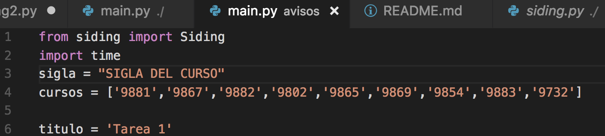
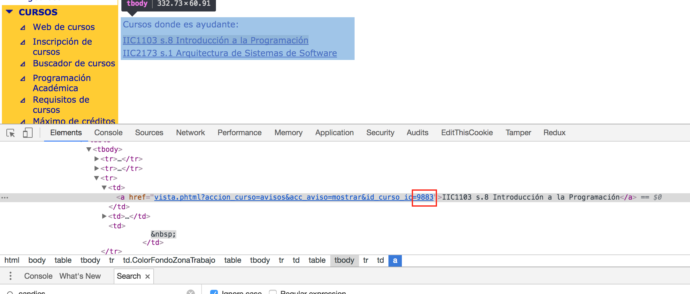
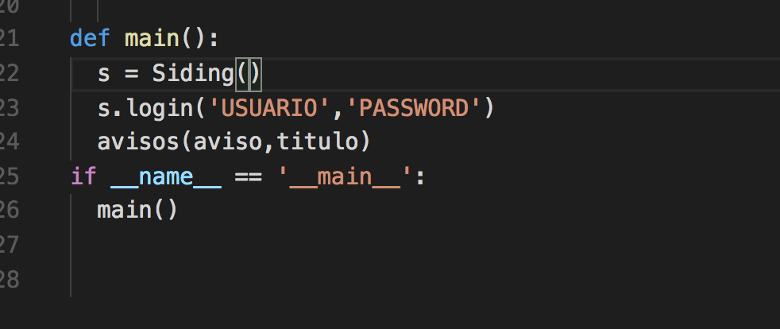
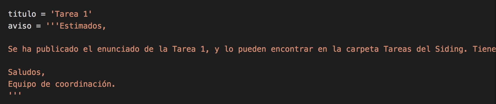

# Avisos Siding 
Para ocupar el programa se debe setear un par de parametros 

# Instalación requisitos
```bash
pip3 install -r requirements.txt
```

## PASO 1
### Para todos los cursos que queramos enviar un aviso necesitamos obtener estos numeros y además rellenar la sigla del curso en la variable `sigla`. 



### Entramos a ingenieria cursos y hacemos inspect a la pagina a través de algún browser


### Luego al hacer inspect encontramos estos valores, y los remplazamos en la variable cursos anterior.


## PASO 2
### Debemos hacer login, para eso deben cambiar rellenar usuario, clave para el programa



# Enviar avisos

### Para enviar un aviso hay que cambiar el contenido de las variables enviar un aviso.


### Luego para enviar el aviso en terminal ejecutar el programa

```bash
python3 main.py
```

